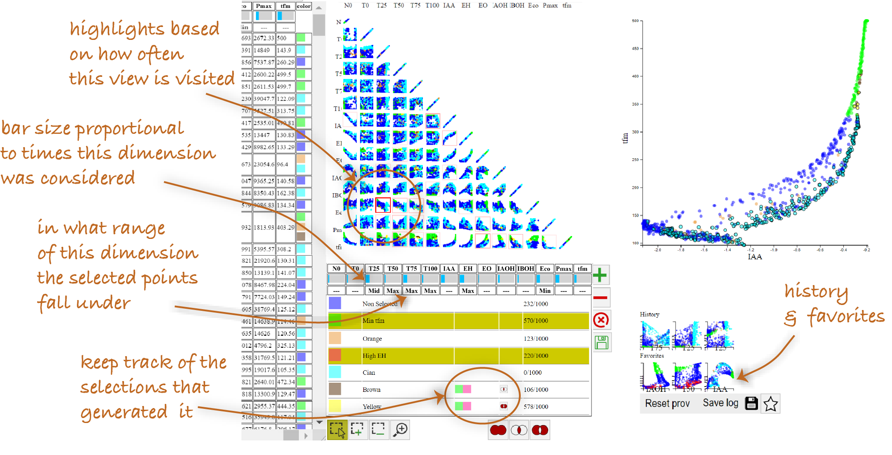

# Understanding How In-Visualization Provenance Can Support Trade-off Analysis

## Abstract
In domains such as agronomy or manufacturing, experts need to consider trade-offs when making decisions that involve several, often competing, objectives. Such analysis is complex and may be conducted over long periods of time, making it hard to revisit. In this paper, we consider the use of analytic provenance mechanisms to aid experts recall and keep track of trade-off analysis. We implemented VisProm, a web-based trade-off analysis system, that incorporates in-visualization provenance views, designed specifically to help experts keep track of trade-offs and their objectives. We used VisProm as a technology probe to understand user needs and explore the potential role of provenance in this context. Through observation sessions with three groups of experts analyzing their own data, we make the following contributions. We first, identify eight high-level tasks that experts engaged in during trade-off analysis, such as locating and characterizing interest zones in the trade-off space, and show how these tasks can be supported by provenance visualization. Second, we refine findings from past work, by identifying specific provenance purposes related to trade-off analysis, like tracking these interest zones. And finally, we identify new opportunities for analytical provenance specific to trade-off analysis, for example related to monitoring the coverage of the trade-off space, and tracking alternative trade-off scenarios.

## Codebook
We collected video recordings of three case studies (324 minutes). Two different authors of this paper independently coded each video using discrete events, then met to discuss annotation codes and resolved conflicts. Our **concordance rate** for the identified provenance events was 71%, and was lower for the high level provenance goals by Ragan et al.

Our codebook is available in <a href="Codebook_Provenance4Tradeoff.csv">CSV</a> format or <a href="Codebook_Provenance4Tradeoff.xlsx">Excel</a>.

## Video
TBD

## Analysis Notebook
TBD

## Contributors
M. Chakhchoukh, Univ. Paris-Saclay, CNRS, INRIA, UMR MIA- Paris, AgroParisTech, INRAE. E-mail: mehdi.chakhchoukh@universite- paris-saclay.fr
N. Boukhelifa, UMR MIA-Paris, AgroParisTech, INRAE, Univ. Paris- Saclay. E-mail: nadia.boukhelifa@inrae.fr
A. Bezerianos, Univ. Paris-Saclay, CNRS, INRIA. E-mail: anab@lri.fr
